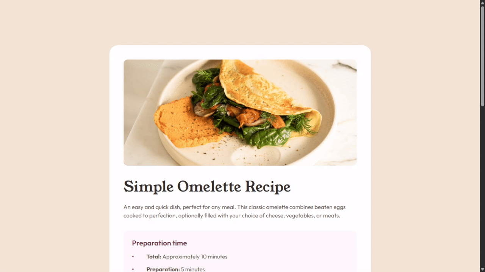

# Frontend Mentor - Recipe page solution

This is a solution to the [Recipe page challenge on Frontend Mentor](https://www.frontendmentor.io/challenges/recipe-page-KiTsR8QQKm). Frontend Mentor challenges help you improve your coding skills by building realistic projects. Status: Completed.

## Screenshot

## Links

- Live Site URL: [Github Pages](https://luizhen527.github.io/recipe-page/)

# My process

## Built with

- Semantic HTML5 markup
- CSS custom properties
- Flexbox

<!-- - [Example resource 1](https://www.example.com) - This helped me for XYZ reason. I really liked this pattern and will use it going forward.
- [Example resource 2](https://www.example.com) - This is an amazing article which helped me finally understand XYZ. I'd recommend it to anyone still learning this 